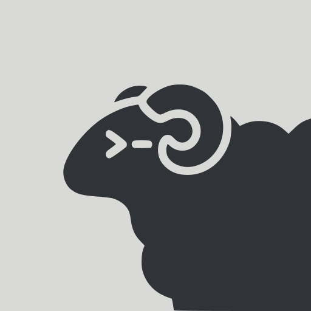
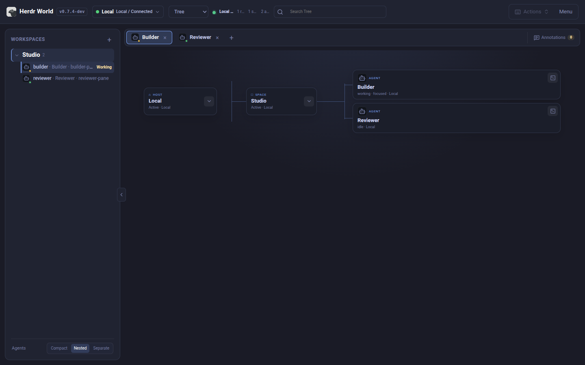
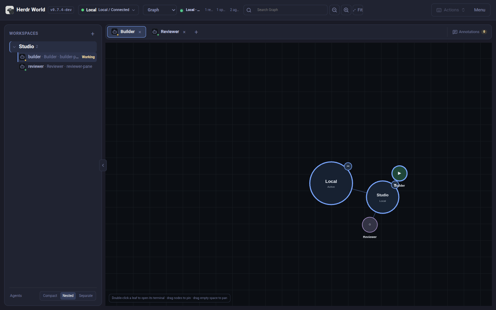
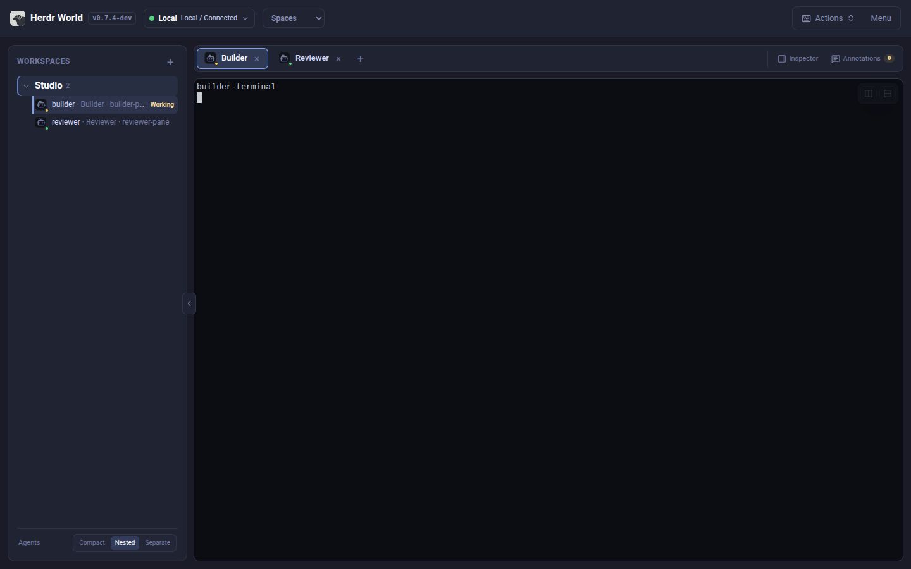
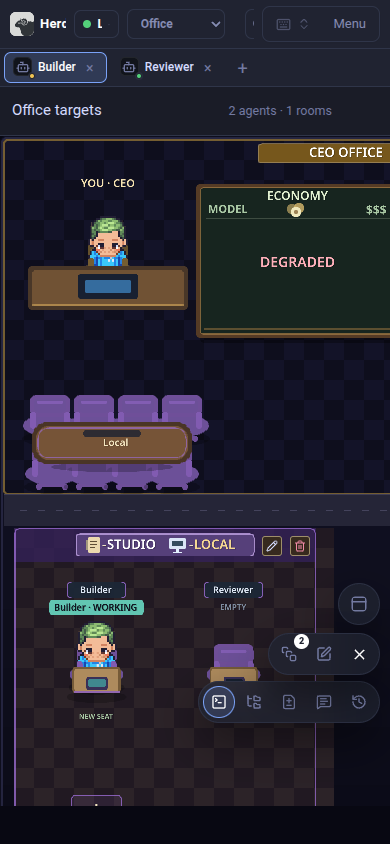
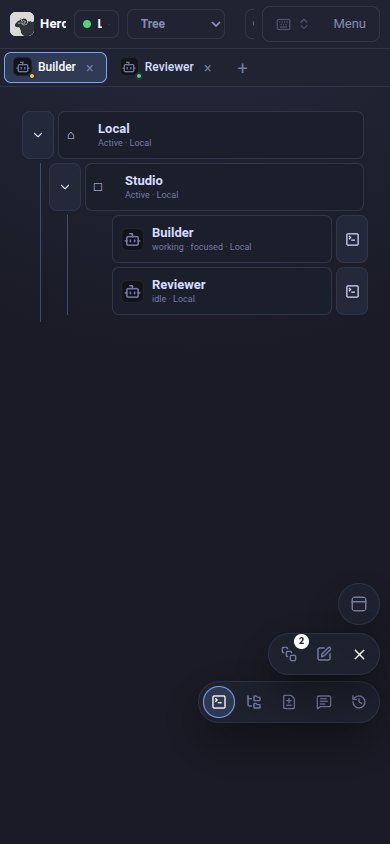
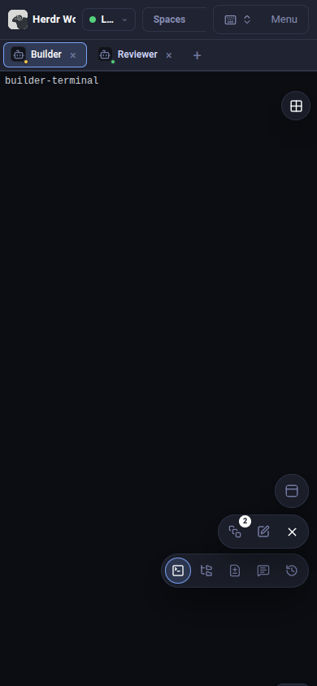

# Herdr World

<p align="center">
  
</p>

A **visual control plane** for [Herdr](https://herdr.dev). Connect local and SSH
hosts, select one host at a time in Office, Tree, Graph, or Spaces, and open its
qualified terminals, files, changes, and agent history on desktop or mobile.
**Requires a running Herdr server.**

## Screenshots

### Desktop

[![Office view showing the selected Herdr host and its agents][desktop-office]][desktop-office]

Office shows the selected host's agent state at a glance. Tree and Graph expose
the same qualified runtime, while Spaces keeps Herdr's full terminal and
repository workflow one click away. Switch the host selector to replace the
whole view; World keeps other managed connections observed in the background.

<!-- markdownlint-disable MD033 -->

<table width="100%">
  <thead>
    <tr>
      <th width="33.33%" align="center">Tree</th>
      <th width="33.33%" align="center">Graph</th>
      <th width="33.33%" align="center">Spaces</th>
    </tr>
  </thead>
  <tbody>
    <tr>
      <td width="33.33%" align="center" valign="top">
        <a href="./docs/images/herdr-world-desktop-tree.png"></a>
      </td>
      <td width="33.33%" align="center" valign="top">
        <a href="./docs/images/herdr-world-desktop-graph.png"></a>
      </td>
      <td width="33.33%" align="center" valign="top">
        <a href="./docs/images/herdr-world-desktop-spaces.png"></a>
      </td>
    </tr>
  </tbody>
</table>

### Mobile

<table width="100%">
  <thead>
    <tr>
      <th width="33.33%" align="center">Office</th>
      <th width="33.33%" align="center">Tree</th>
      <th width="33.33%" align="center">Spaces</th>
    </tr>
  </thead>
  <tbody>
    <tr>
      <td width="33.33%" align="center" valign="top">
        <a href="./docs/images/herdr-world-mobile-office.png"></a>
      </td>
      <td width="33.33%" align="center" valign="top">
        <a href="./docs/images/herdr-world-mobile-tree.png"></a>
      </td>
      <td width="33.33%" align="center" valign="top">
        <a href="./docs/images/herdr-world-mobile-spaces.png"></a>
      </td>
    </tr>
  </tbody>
</table>

<!-- markdownlint-enable MD033 -->

Click any screenshot to open the full-resolution image.

[desktop-office]: ./docs/images/herdr-world-desktop-office.png

## Quick start

1. Install and start [Herdr](https://herdr.dev), or let Herdr World install and
   start it later with `herdr-world herdr setup`.
2. On Linux or macOS, install Herdr World:

   ```bash
   # Empty selects latest; use X.Y.Z (no v prefix) to pin a Herdr World version.
   curl -fsSL \
     https://github.com/IvoryHeart/herdr-world/releases/latest/download/install-herdr-world.sh \
     | HERDR_WORLD_VERSION= sh
   ```

   On Windows, download the matching x64 or ARM64 archive from the
   [latest release](https://github.com/IvoryHeart/herdr-world/releases/latest).
3. On Linux/macOS, add `~/.local/bin` to `PATH` and run `herdr-world`.
   On Windows, extract the archive and run `herdr-world.exe`. Open the printed URL.

Use the connection selector to add local sockets or an SSH destination. One World
service owns every connection; each browser selects one operational host and stays
on the same World origin. Office, Tree, Graph, visible counts, and search follow
that selected host until simultaneous active-host interaction is supported.

See [deployment](./docs/DEPLOYMENT.md) for checksums, profiles, authentication,
updates, and services.

## Install as a PWA

**PWA installation is recommended for daily use:** a separate app window without
browser tabs or the address bar. Open and authenticate with Herdr World, then install:

- **iPhone/iPad Safari:** Share -> Add to Home Screen.
- **macOS Safari 17+:** File -> Add to Dock.
- **Chrome/Edge:** browser menu -> Install app.

The process must stay running and reachable. **PWA mode is not offline access.**

## Documentation

- [Website](https://ivoryheart.github.io/herdr-world/) and
  [hands-on tutorial](https://ivoryheart.github.io/herdr-world/tutorial/)
  ([Markdown](./docs/TUTORIAL.md)): local work, mobile, and private remote access.
- [Features and shortcuts](./FEATURES.md)
- [Deployment](./docs/DEPLOYMENT.md): installation, configuration, services, builds.
- [Architecture](./docs/ARCHITECTURE.md): system contracts.
- [Development](./docs/development.md), [packaging](./docs/packaging.md), and
  [release process](./docs/release.md).
- [Security](./SECURITY.md) and [contributing](./CONTRIBUTING.md).

## Development

Use Bun 1.4.1 or newer and a running Herdr server:

```bash
bun install --frozen-lockfile
# Run in separate terminals:
bun run dev:server
bun run dev:web
```

Open <http://localhost:5173>. See [CONTRIBUTING.md](./CONTRIBUTING.md) for checks
and pull requests.

## Security

Herdr World controls terminals and modifies real files. Keep the default loopback
binding; read [SECURITY.md](./SECURITY.md) before allowing another device access.

## License

Code: [MIT](./LICENSE). Bundled dependencies, fonts and brand assets retain their
original terms; see [THIRD_PARTY_NOTICES.md](./THIRD_PARTY_NOTICES.md) and the
generated [dependency licence texts](./DEPENDENCY_LICENSES.md).
