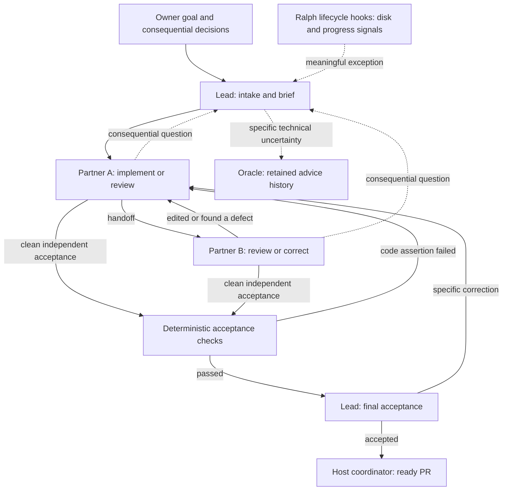

# Agent development

The owner-selected [Superpowers trial](superpowers-trial.md) evaluates an upstream
skills bundle with native Codex. It is local to a fresh task worktree; it does not
replace or restart existing Ralph runs. The procedures below describe Ralph.

OpenSpec holds current contracts, repository skills describe useful practices, and Ralph
Orchestrator runs a sequential pair. The default is **one task worktree, one prepared
environment, two persistent partners, and a lead**. Oracle is consulted for a concrete
technical question. A different persona does not need another repository copy.

This guide owns orchestration procedures. AGENTS.md owns repository-wide authorization
and delivery rules; skills provide task-specific judgment. The shared partner response
protocol lives in `harness/roles/pair.md` and is injected for A and B; their individual
prompts state only their starting responsibility. Model allocations remain in
`harness/models.json`. Update the owner of a rule instead of copying it into each skill.

## Start and continue

After `npm run agent:bootstrap` and `npm run agent:image`, a short goal is enough:

```bash
npm run agent:goal -- "Make saved connections easier to find" --parent 78 --background
```

Use the requested parent PR; omit `--parent` for main. world-start-task launches this
entrypoint before feature research or editing. It creates a non-main task worktree
under the primary checkout's ignored `.agents/worktrees/`. Existing `.agents/.worktrees/`
locations remain valid. Legacy World workflow skills live in `harness/legacy-skills/`
and are read on demand for a Ralph task. Managed intake inspects source and
asks only consequential questions. Relay the owner's answer with:

```bash
npm run agent:run -- resume RUN_ID --task-file /path/to/private/answers.md --background
```

Human waiting consumes no run allowance. Source-grounded acceptance and the plan remain
supervisor-owned. Routine fixes do not need a new OpenSpec proposal. Update the existing
contract when required; do not create a numbered spec for each correction.

For an existing clean linked task worktree, use `agent:run start --task-file <file>`.
Do not create a fresh run merely because a check failed. A blocked or interrupted run
resumes its current step, histories and allowance. Changes to frozen controls use explicit
recovery, below. Harness maintenance is interactive: record
`agent:task interactive --reason harness-maintenance --note "<authorized change>"`.
An ordinary feature needs an explicit owner request to use the interactive exception.

An owner image can accompany a goal or answer with `--reference-image <absolute-path>`.
Up to four PNG/JPEG/WebP images (20 MiB each) are copied into private read-only controls
and attached to model turns. Images do not enter source merely to transport them.

## Agent map



| History | Responsibility | Source access |
| --- | --- | --- |
| Lead | Intake, brief, scope decisions, governor judgment, final acceptance | Read-only |
| Partner A | First implementation, later review or correction | Writable while active |
| Partner B | Independent first review, later correction or review | Writable while active |
| Oracle | Bounded technical investigation on request | Read-only |
| Supervisor / verifier | Route, account, check, retain evidence | No model |

The lead uses product shaping, analysis and governor **skills**, not mandatory additional
agents. The pair can challenge a brief before editing and can consult the lead without
replaying intake. Security, protocol, accessibility and performance are review lenses;
sensitive tasks require the security and protocol lenses.

A implements a coherent increment; B examines the task delta and acceptance. B may make
a clear correction, in which case A reviews B's edits. A reviewer can also return concrete
findings without editing. **The latest editor cannot accept their own changes.** A clean
review can proceed immediately; alternating roles is optional, not another required lap.
Behavioral evidence must cover every acceptance criterion. Agreement alone is insufficient:
required checks and read-only lead acceptance must also pass for the same candidate.

Use stable IDs for unresolved behavioral findings. Optional taste, speculative hardening
and new scope do not block delivery. Repeated unresolved findings trigger lead guidance;
recurrence after guidance pauses with a diagnosis. Successful model turns reset consecutive
backend failures, rather than waiting for the whole delivery to succeed. Overall activation
and model-time ceilings still bound a run.

The pair's histories are independent. Sharing a worktree does not share an LLM context or
make context free. Native sessions resume with a source delta and changed decisions; read
additional context for concrete gaps. Short structured handoffs are persisted outside model
writable storage. The lead does not relay ordinary handoffs or monitor every command.

## Workspace and environment

`run/workspace` points to the actual task worktree. One supervisor lock covers that worktree,
so overlapping runs cannot schedule simultaneous writers. Every partner and the verifier
uses those same source files, installed dependencies, browser cache and Rust build outputs.
Model containers are disposable; source, native homes and reports persist on disk.

Preparation runs once per image, profile and dependency lock set, with installed-directory
checks before reuse. npm, Cargo and browser download caches persist in the task worktree.
There is no per-review copy, per-verification copy or QA copy helper in pair mode. Frozen
controls retain the scripts and Ralph binary without duplicating the entire host harness
node_modules tree. Existing stopped runs are not automatically deleted.

The pinned Ralph archive is cached under the npm cache's `world-ralph/` directory
(`.agents/cache/npm/world-ralph/` when installing directly). Every cache read checks its
manifest SHA-256 before extraction. Missing/corrupt cache entries download again;
incomplete or mismatched downloads cannot replace a verified entry. Recognized transient
HTTP/network failures receive at most two retries with short backoff, without a model
turn. Permanent errors and checksum mismatches stop preparation with their cause.

Containers retain the existing restrictions: no host home, Herdr/SSH/Docker sockets or
published ports. Git metadata, controls, handoffs and Ralph state are read-only in model
turns; only the active native home is mounted. Linked Git metadata is mounted read-only
at its referenced location so ordinary Git inspection works. Read-only lead and Oracle
turns report through structured output. Publishing stays outside worker containers.
Dependency setup and model calls have network egress. Acceptance checks use no model auth;
only the advisory audit has egress. This remains a trusted local development harness.
Lifecycle hooks coordinate work and inspect health; they are not a filesystem security boundary.

Use a clean runner account: Ralph 2.10.1 merges global hooks, so the wrapper rejects
`~/.ralph/config.yml`. Model calls ignore personal Codex configuration. Credentials are
mounted from the selected `--auth-file`, never copied into candidate source or evidence.

## Time, checks and recovery

Pair defaults are 24 activations and **3,600 seconds of model execution time**. `--seconds`
sets that total, including all native model turns. It excludes managed dependency setup,
deterministic verification and waiting for the owner. There are no reserved phase shares
or 90/120-second planning caps. A model receives its remaining allowance and a checkpoint
before the deadline; graceful termination is bounded. This is not a token or spending cap.

`--command-seconds` separately sets the per-command safety ceiling (default 2,700 seconds,
45 minutes; maximum two hours). Expected-duration warnings observe slow checks before that
ceiling. A wider outer process failsafe catches supervisor failures; it is not permission
to spend additional model time. A code timeout inside a repository test remains a test
failure that needs diagnosis; the harness does not automatically relax test controls.

Partners run focused checks during editing. Complete suites run after pair agreement:

| Profile | Required commands |
| --- | --- |
| check | `npm run check` |
| acceptance | `npm run check`, `npm run test:e2e`, `npm run test:security`, `npm run test:independence` |

Passed-command receipts survive a retry/resume when source, image and command are unchanged.
A later code change conservatively invalidates check reuse. We have not built a speculative
test dependency graph. The saving comes from checking at acceptance and resuming failed
steps, rather than executing the whole suite after each role or reinstalling each time.
Final delivery still requires evidence for the exact complete source and acceptance.

One recognized transient infrastructure failure is retried without a model. A deadline,
interruption or recurring infrastructure failure saves the failed step and pauses; it does
not send the pair an invented code defect. A real assertion failure returns its log to the
pair. A repeated identical failing candidate stops for diagnosis. Disk/inode checks warn
about dwindling reserves and suspend on a critical reserve, without deleting evidence or
another agent's worktree. Unknown failures remain visible in logs; classification is fallible.

Read outcomes with `agent:run status RUN_ID` or `agent:task status` in the task worktree.
Ready requires pair evidence, complete checks and lead acceptance. A stopped outcome is not
success. Harness/dependency/control edits require interactive review because workers cannot
change the frozen rules that authorize their own delivery.

### Upgrade a stopped task to new controls

First incorporate the updated harness branch into the **existing task branch**, retaining
its feature commits. Do not resume the old run expecting it to discover new controls.
From that task worktree:

```bash
npm run agent:run -- recover OLD_RUN_ID --prepare-only
# Inspect the printed recovery run and retained/imported candidate, then:
npm run agent:run -- resume NEW_RUN_ID --background
```

Omit `--prepare-only` to prepare and continue directly. Recovery checks the old run is
stopped and the source revision is still an ancestor. It preserves the old run, imports a
legacy `candidate.patch` only when `git apply --check` succeeds (or detects it was already
applied), and records lineage. Conflicts require explicit reconciliation; nothing is reset.

For the former two-history workflow, its author history becomes Partner A, its independent
review history becomes Partner B, and the lead starts fresh. Small native state is copied;
old evidence is not edited. Acceptance and the plan carry forward, while old approvals and
receipts do not authorize the updated run. Review starts from preserved work rather than
restarting research. Pair-to-pair recovery retains the corresponding native groups.

Remaining time and activations carry forward by default. Extending them requires explicit
`--seconds` / `--iterations`; an exhausted allowance is never silently reset. Prior usage
remains in the recorded lineage and must be included when comparing total task cost. A
model migration is not a guaranteed cost reduction. For unchanged controls, prefer ordinary
resume: it also preserves valid check receipts.

### Background supervision

Use `--background` from an agent conversation. A deterministic process owns the job.
`agent:job status JOB_ID` reads it; `agent:job wait JOB_ID` waits on filesystem events for
up to 60 seconds. **Do not repeatedly spend model turns polling a healthy job.**

The background supervisor writes `.agents/jobs/JOB_ID/recap.json` and a structured line
in its private `supervisor.log` every **five minutes**, plus a final recap at exit.
This needs no model call. `npm run agent:job -- recap JOB_ID` produces a current read-only
snapshot on demand, including for older runs. Recaps show the last completed handoff,
active role/command and elapsed time, unresolved findings, command results, remaining
model allowance, recorded usage and last known disk health. They label observation time
and incomplete usage coverage; cached input is included in input. No raw terminal output,
credentials or transcripts are copied. A long check or silence is not proof of a stall.

Use world-recap-run to summarize these facts for the owner or regain orientation after
compaction. Each model activation also receives the last completed handoff and unresolved
findings as a small context delta. A recap never approves source, replaces the brief or
resets allowance. Read specific handoffs/source when the recap leaves a concrete gap.

Where the host supports notifications, relay periodic progress about five minutes apart
and completion/material blockers promptly. Producing a recap file is not a chat callback:
without host integration, report the job and recap location once and return. The run
continues independently. Do not add a polling model to simulate wake-up. Fully unattended
host wake-up/publishing must be validated in the actual integration. The inner lead handles
governor decisions; the host coordinator delivers the accepted candidate.

These changes affect newly launched jobs/updated controls. Do not modify or restart an
active trial to install a reporting improvement; inspect an older run with the read-only
recap command and apply controls through the stopped-task recovery procedure when needed.

## Models and comparisons

`harness/models.json` keeps Sol high for lead and both partners, and Sol xhigh for Oracle.
This holds model allocation steady while testing the workflow change; it is not a measured
optimum. `--model` and `--reasoning-effort` provide uniform comparison overrides. `--lead-model`
covers the default lead/pair tier; `--oracle-model` covers advice. Legacy `--workflow two-history`
and `--workflow full` remain explicit comparisons; the latter uses Luna xhigh for bounded
workers and responds to `--worker-model`. Their copied workspaces and stage budgets are
historical policies, not the default. Ordinary resume preserves resolved allocation.

Oracle remains at most two consultations per run. It advises the caller, never edits,
redefines acceptance, resets budgets or certifies completion. No standing committee or
additional graph/observer service is installed.

## Delivery and evaluation

Pair edits already exist in the task worktree: **do not apply its exported candidate.patch
again and do not repeat passed suites just to publish**. Inspect the delta and saved evidence,
commit the verified contents, then use:

```bash
npm run agent:task -- report
npm run agent:deliver -- --title "Improve saved connections" --body-file /path/to/private/pr.md
```

The helper rejects main, dirty source, stale receipts and missing native independence. The
latest proposal and approval must come from different native histories; lead acceptance must
be independent of both partners. Prior authorship does not permanently disqualify a partner
from reviewing the other's later edits. A content-identical commit keeps receipts current.
CI remains an independent check. Stop at the open ready PR; never merge without owner direction.

For a stacked task, pass `--base <recorded-parent-branch>`. The delivery helper requires
a matching task record and appends execution mode, run ID and role/model evidence to the
PR body. For interactive work or stale/missing receipts, use `agent:verify -- <profile>`;
this does not substitute for a missing harness run. For an existing PR, inspect the task
report and current verification before pushing its update and retain the execution report.
Use `agent:deliver --draft` for an early checkpoint and `agent:deliver --ready <PR>` only
when final evidence passes.

An early draft is optional for a coherent checkpoint when visibility helps. The host may
publish it explicitly as incomplete under the recorded task; it is not accepted delivery.
Keep ordinary pair discussion local. Before marking a draft ready, use the same final
execution and verification gates. Draft visibility never waives review or acceptance.

For harness maintenance, use `npm run agent:verify -- check`, plus `test:agent`, `spec:check`
and `eval:check`. Production-supervisor regression uses
`node --test scripts/agent/container.test.mjs` with a deterministic fake Codex image and no
model credentials. These checks prove routing/recovery mechanics, not autonomous feature
quality or subscription savings. [Evals](../evals/README.md) retain held-out graders and live
baselines. The next real task must measure accepted outcome, elapsed time, repeated checks,
model calls, input/cached/output tokens, interventions and disk growth across the whole task.

Private run ledgers record native response usage, deduplicate response IDs and recover killed
attempts. Cached input is included in input, not additional usage. Missing/in-flight responses
make reports lower bounds; token counts cannot be converted to subscription quota or money.
Use `agent:metrics RUN_ID --lineage` after a run stops for role/model usage, command durations,
storage measurements and recorded predecessors. Unlinked earlier runs and host coordinator
usage are explicitly outside that aggregate; include them separately in task comparisons. Optional `--loki <origin>` reconciles response IDs
with OTEL storage. Prometheus model totals alone cannot attribute overlapping sessions.
OTEL setup uses `--otel-endpoint`, `WORLD_AGENT_OTEL_ENDPOINT`, or the primary checkout's
ignored `.agents/state/telemetry.json` (`{"endpoint":"http://127.0.0.1:4318"}`). Docker loopback
is mapped explicitly. Exported fields exclude prompts/tool output; raw evidence stays private.

Historical [live](evidence/agent-development-live-trials.md),
[session](evidence/agent-session-trials.md) and [efficiency](evidence/agent-efficiency-trials.md)
trials describe the earlier workflows. They do not validate the new pair policy. Graphify
remains optional; [selected ECC practices](../harness/README.md#selected-ecc-practices) improve
retrieval and handoffs without another orchestrator. Current knowledge remains in OpenSpec,
source, tests and linked runbooks, not generated scratchpads.
