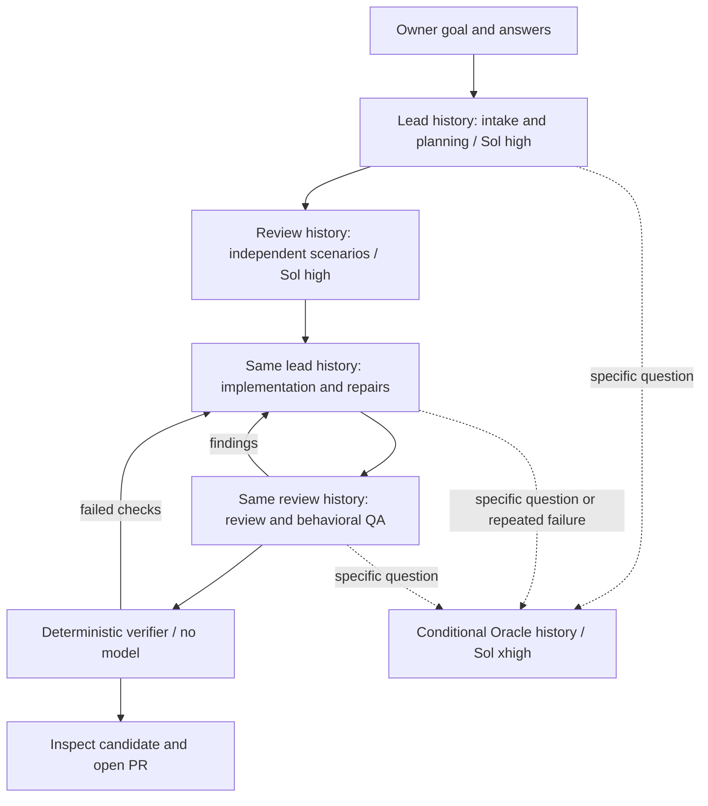

# Agent development

The development harness combines OpenSpec, focused repository skills, Ralph Orchestrator
and Harbor evals. It supports ordinary interactive work and explicitly started bounded
runs. Product architecture changes remain a separate concern.

## Start a task

After the one-time `npm run agent:bootstrap` and `npm run agent:image` setup, a short
goal is enough. In an agent conversation, world-start-task handles the same flow.

```bash
npm run agent:goal -- "Make saved connections easier to find"
# Stack the experiment on an open same-repository PR:
npm run agent:goal -- "Make saved connections easier to find" --parent 78
```

The command fetches the selected base, creates a fresh task worktree, and starts
read-only research and intake. It defaults to the feature task profile and acceptance
checks; use `--task-profile routine --profile check` for a source-only fix. If a
consequential answer is missing, it prints saved questions and a run ID, then exits.
Save the answers in an ignored/private file and run:

```bash
npm run agent:run -- resume RUN_ID --task-file /tmp/world-answers.md
```

The same lead session continues into planning once acceptance is clear; product shaping
is not repeated. Waiting for the reply consumes no loop time or running container.
A bare resume cannot bypass pending interview questions. The CLI ends with a candidate
and evidence; the coordinating agent handles inspection and authorized PR delivery.

For an already prepared task, create its worktree directly:


```bash
npm run agent:worktree -- create fix-reconnect
# Enter the path printed by the command.
npm run agent:bootstrap
npm run agent:doctor
```

Worktrees share the primary checkout's ignored `.agents/.worktrees/`. Creation fetches
`origin/main`; pass an explicit ref as the last argument to use an existing commit without
fetching. Each task gets `agent/<slug>`, never main. Existing worktrees are left alone.
`agent:worktree -- list` and `doctor` show placement. Remove finished worktrees with
Git's normal worktree command after preserving any uncommitted work; there is no automatic cleanup.

Read AGENTS.md and the relevant [knowledge-map](knowledge-map.md) entries. Repository
skills are discoverable under `.agents/skills/`. Use the skill matching the task rather
than loading every skill. Agents without native skill discovery can read those same files.

## Knowledge and OpenSpec

| Information | Owner |
| --- | --- |
| Mandatory repository and delivery rules | AGENTS.md |
| Current observable capability contracts | openspec/specs |
| Proposed coherent changes | openspec/changes |
| Source ownership, operation and troubleshooting | docs/knowledge-map.md and linked runbooks |
| Historical decisions and research | docs/specs and docs/analysis |
| In-flight progress, role histories and recovery notes | ignored .agents/runs/<id>; .ralph/agent inside its candidate |
| Grading evidence and generated graphs | ignored eval/run output; never authoritative |

Use a proposal for an owner-requested spec or a genuinely new contract. Routine fixes,
refactors, dependencies, tests, docs and release mechanics need no new change proposal.
A small fix may still update an affected current spec. Existing authorization carries
through planning, implementation, verification and authorized PR delivery.

```bash
npm run spec -- new change improve-terminal-recovery
npm run spec -- status --change improve-terminal-recovery --json
npm run spec -- instructions proposal --change improve-terminal-recovery --json
npm run spec -- instructions apply --change improve-terminal-recovery --json
npm run spec:check
```

Follow the CLI's schema, dependency order and returned artifact paths. Keep one change
per outcome. Synchronize implemented deltas into current specs before archiving.
A task checkbox is progress, not proof. Do not archive unfinished work. The standard
`spec-driven` schema is sufficient; project context and rules are advisory and checks
remain executable.

The six OpenSpec skills are concise repository adaptations of version 1.12.0.
Upstream's mandatory planning pause does not replace the user's existing authorization.
Review generated skill updates before adopting them; do not run an installer that silently
overwrites repository policy.

## Roles and skills

| Role | Work | Boundary |
| --- | --- | --- |
| Intake | world-start-task; source research, consequential questions, acceptance | Lead history; read-only; owner supplies missing decisions |
| Product manager | world-shape-work; user outcome, scope, non-goals and acceptance | Feature intake only; read-only; no invented research or roadmap authority |
| Planner | world-plan-change; inspect source, plan and select specialist lenses | Read-only; preserves existing acceptance exactly |
| QA planner | world-test-behavior; derive scenarios before implementation | Read-only; covers every acceptance criterion independently |
| Implementer | Implement; world-verify-change and conditional world-maintain-knowledge | One worker, one candidate; no publishing authority |
| Reviewer | world-review-change plus selected world-review-specialist lenses | Independent review history; candidate mounted read-only in local runs |
| Behavioral QA | world-test-behavior; exercise every planned scenario | Read-only source; evidence per scenario; no repairs |
| Oracle / technical adviser | world-consult-oracle; investigate a concrete technical question | Read-only; at most two consultations across the run and resumes |
| Verifier | Deterministic commands | No model call; separate candidate copy and no model credential |
| Supervisor | Ralph plus the repository adapter | Limits, events, recovery and content-specific completion |
| Publisher | world-deliver-pr outside the loop | Push task branch and open PR; never merge |

Role instructions live in harness/roles; skills supply reusable procedures. Executable
permissions, schemas and routing live in scripts/agent, not just prompts. A role is a
procedure and permission set, not necessarily another agent instance. The loop's
internal review does not replace independent PR review.



The default `--workflow two-history` keeps one lead history and one independent review
history. Product, planning and QA are phases with skills, rather than mandatory new
agents. Only one model call runs at a time; workers cannot spawn additional agents.
A finished turn leaves a resumable native history, not an idle model process. The next
phase recreates its container and resumes the exact ID with current permissions/schema.
The lead's planning phase remains read-only; only implementation can write the candidate.

Use `--workflow full` explicitly when a separate bounded builder is useful: it retains
lead, builder and review histories and assigns implementation/QA to Luna xhigh. Oracle
remains conditional in either workflow. Neither workflow replaces independent PR review.

## State, Docker and context reuse

Docker supplies the pinned execution environment and mount boundaries. Durable state
lives on the host under the primary checkout, outside the disposable containers:

```text
.agents/
  .worktrees/<task>/                task branch and eventual PR
  runs/<run-id>/
    run.json                       acceptance, evidence, limits, delivery base
    control/                       frozen harness and role schemas
    workspace/                     isolated candidate, no publishing remotes
    sessions/lead|review|oracle/     full workflow also has builder/
      session.json                 supervisor-owned native ID and checkpoint
      home/                        that group's native Codex files
    handovers/                     read-only structured turn results and deltas
    checkpoints/                   candidate delta and activity near a deadline
    usage.jsonl                    append-only response usage and lifecycle events
    usage-summary.json             recovered totals and coverage limitations
    telemetry-export.json          export cursor; retry without transcript export
    candidate.patch                proposed source change
  jobs/<job-id>/                    optional background supervisor and private log
```

Only a group's own native home is mounted writable at `/agent-home`. Its metadata
remains outside the mount; `/handover` is read-only. Other groups' transcripts are not
exposed. Authentication is a separate read-only mount, never a copied credential.
The native thread ID is saved as soon as Codex reports it, so interruption does not
depend on receiving a final answer. New runs use schema 4. Schema 3 runs retain their original frozen controls and allocation
on resume; starting a new run is required to adopt the new policy. Older schemas remain
inspectable but cannot resume with new controls.

The adapter sends changed supervisor fields, current role instructions and a Git delta
since that history last observed the candidate. Source snapshots include new files and
deletions without modifying the candidate index. Shared summaries retain decisions,
evidence and source pointers. A returning reviewer checks affected behavior and new
defects as well as old findings. Retained history is useful context, never valid approval
for changed source. Native compaction may shorten long histories; factual handovers
provide recovery when useful details are no longer present.

For local Docker runs, `--sessions fresh` starts an isolated history per invocation for comparison; persistent is the
default and the choice is frozen on resume. Reuse avoids repeated exploration and
allows native caching, but does not mean old context is free. No subscription-usage
saving is claimed without a controlled comparison. State retention and container
instance/space optimization are deferred; deleting a run deletes its native histories.


Choose a task profile separately from the verification profile:

| Task profile | Routing |
| --- | --- |
| routine (default) | Planner → QA planner → implementer → reviewer → QA → verifier |
| feature | Product manager → routine delivery stages; product shaping happens once per outcome |
| sensitive | Routine stages with mandatory security and protocol review lenses |

The planner can activate security, protocol, ux-accessibility or performance review for a
concrete risk in any profile. These lenses extend the reviewer activation; they do not
create an always-on committee. Browser/runtime changes still need the acceptance verification
profile. Routine fixes never acquire a mandatory OpenSpec proposal just by entering a loop.

Product/planner acceptance criteria become supervisor-owned state. QA scenarios are derived
before implementation and must cover every criterion. The QA result must include all scenario
IDs, outcomes and execution/source evidence. Passing requires every scenario to pass.
QA planning produces executable scenarios, without a general baseline test run. During
QA execution, run `node /control/scripts/agent/fixture.mjs` from `/workspace` once to create
a writable web test copy in `/tmp`. It copies prepared dependencies instead of symlinking
them, including Vite's writable temporary configuration directory. Reuse the printed
path for that invocation; browser binaries remain in the prepared cache. QA cannot repair
the candidate. Complete repository/Rust verification runs in its separate writable copy. LLM-reported QA evidence is still fallible; the deterministic verifier and held-out
eval grader provide additional independent checks.

Planner, QA planner, implementer, reviewer and QA can request an Oracle consultation with a
specific question. Two consecutive candidate failures automatically trigger a consultation
before another repair. Advice returns to the requesting role and cannot change acceptance,
reset the failure budget or override checks. An owner clarification on resume can revise scope;
the runner invalidates the old acceptance and QA plan and starts shaping/planning again.

Knowledge maintenance normally happens within implementation. A targeted drift audit can
use world-maintain-knowledge separately. The eval/harness engineer uses world-evaluate-harness
between runs to turn failures into cases and propose improvements through PRs. In-flight
workers cannot change their control copy or grader. Coordinating multiple worktrees uses
world-integrate-work interactively; autonomous parallel scheduling remains disabled until
there is an authorized concurrent workload and evidence to justify it.

## Models

The committed policy in harness/models.json uses **gpt-5.6-sol at high** for the default
lead and reviewer, and **gpt-5.6-sol at xhigh** for focused Oracle advice. The optional
full workflow uses **gpt-5.6-luna at xhigh** for bounded implementation and QA work.
Supervisor and verifier do not call a model.

This allocation is a trial policy, not a measured optimum. `--lead-model`, `--worker-model`
and `--oracle-model` override their respective tiers; the worker tier is used in the full
workflow. `--model` overrides all roles and `--reasoning-effort` overrides all effort levels
for controlled comparisons. Astra is an explicit Oracle escalation for a concrete hard
question, not the default outer monitor. Allocation is frozen on resume; no silent fallback.

## Verification

```bash
npm run agent:verify -- check
npm run agent:verify -- acceptance
npm run agent:verify -- harness
```

| Change | During implementation | Delivery evidence |
| --- | --- | --- |
| Ordinary source changes | Relevant Vitest/Rust/Node tests | check |
| Browser behavior or runtime integration | Relevant fixture browser scenarios | acceptance |
| Harness, rules, roles or skills | test:agent, spec:check, eval:check; relevant Harbor trials | check plus harness/eval evidence |
| Release, packaging or vendor changes | Corresponding runbook checks | check plus required distribution evidence |

A receipt in `.agents/state/verification.json` includes the source fingerprint,
commands, exit codes, duration and logs. The fingerprint covers tracked and non-ignored
new source, executable bits and symlinks; generated state is excluded by Git ignores.
Any source edit invalidates the receipt. A content-identical commit does not.
Run `npm run check` before committing. Failed or unrun checks are reported as such.

Browser screenshot captures go under ignored `.scratch/playwright/evidence/`, which
is included in the normal Playwright CI artifact. Tests must not overwrite tracked
historical evidence or public images: doing so changes the source fingerprint during
verification. To refresh published screenshots intentionally, inspect the generated
captures and copy the selected images into their documentation paths as a separate
source change before verifying it.

CI runs deterministic harness checks and spec validation on PRs without model credentials.
The `Delivery checks` job requires all normal CI, browser, macOS and harness jobs.
The GitHub rules helper prepares or checks the corresponding main-branch policy.

## Bounded unattended runs

Build the image once and start from a clean, committed task branch:

```bash
npm run agent:image
npm run agent:run -- start --task-file /tmp/world-task.md --task-profile feature --profile acceptance
# Optional uniform model override for a controlled comparison:
npm run agent:run -- start --task-file /tmp/world-task.md --model gpt-5.6-luna
npm run agent:run -- status RUN_ID
npm run agent:run -- resume RUN_ID
npm run agent:run -- resume RUN_ID --task-file /tmp/world-clarification.md
```

The task file must describe an authorized outcome and its known constraints. The selected
models must be available to your account. Codex is the initial backend. The adapter
uses its pinned CLI and saved authentication; `--auth-file` selects an explicit auth file.
Credentials are never copied into the repository or result bundle.

A run copies the candidate into a private repository without remotes or shared Git metadata,
under the primary checkout's ignored `.agents/runs/<id>/workspace`. It freezes a separate
control copy of the harness. Ralph owns routing and process activations; the adapter owns native history continuation. Repository code
adds container execution, structured role events, verification and the final content gate.

Default bounds remain 24 activations, one hour and three consecutive failures. `--seconds`
scales cumulative stage ceilings, which survive retries and resume:

| Stage | Share | Default ceiling |
| --- | --- | --- |
| Intake, product, planning, independent scenarios | 15% | 9 minutes total |
| Oracle advice | 5% | 3 minutes total |
| Implementation and repairs | 45% | 27 minutes total |
| Review and behavioral QA | 20% | 12 minutes total |
| Deterministic verification | 15% | 9 minutes total |

Preparation also has per-turn caps: intake 180 seconds, product 90, planning 120,
scenario design 90; Oracle is capped at 180. Unused stage allocations stay reserved;
a preparation overrun cannot consume implementation or verification time. These are
initial policies to evaluate, not guarantees that every feature fits an hour.

The prompt supplies the root, current phase, compact changed context and soft deadline.
At 80% of a turn's allowance the supervisor saves a source delta and last activity time;
near the ceiling it sends SIGINT for a bounded flush, then kills remaining descendants
and removes the invocation's container. A checkpoint is recovery evidence, not approval.
Quiet periods are visible in activity timestamps; they are not automatically classified
as a stuck model. There is no longer a blanket 15-minute implementation kill. Ralph's
custom adapter timeout is materialized above the run limit, leaving deadlines to the supervisor.

Initial dependency preparation has its own 20-minute cap. Human waiting is excluded from
active budgets. Resume retains candidate, histories and handovers and archives the old
Ralph ledger; stale completion events cannot bypass review. Clarification cannot reset
limits. Exhausted runs require a new authorized run. A hard-killed supervisor can leave a
lock: confirm its recorded process and owned containers have stopped before recovering it.

### Background execution

Add `--background` to `agent:goal` or `agent:run start/resume`. The command returns a job
ID and private log location. `agent:job status JOB_ID` reads its state; `agent:job wait
JOB_ID` waits on filesystem events for completion/questions/failure (up to 60 seconds).
The background process continues with no outer model monitoring it. Use the host agent's
completion notification when available; do not spend turns repeatedly running sleep or
re-reading the task. Relay actual questions or failures, then resume the saved run.

### Usage and OTEL

Every invocation records lifecycle events before starting. The supervisor tails native
`token_usage_record` response usage, deduplicates response IDs, and recovers after interrupted
turns. It sums per-response usage, including compaction, never cumulative thread totals.
Even fresh comparison histories persist privately for accounting. Missing native records
are labelled; a turn summary fallback or killed in-flight response makes totals a lower bound.
Reports keep cost null unless measured; token totals are not a subscription invoice.

Configure the OTLP HTTP origin explicitly with `--otel-endpoint`,
`WORLD_AGENT_OTEL_ENDPOINT`, or the primary checkout's ignored `.agents/state/telemetry.json`:

```json
{ "endpoint": "http://127.0.0.1:4318" }
```

Loopback is mapped to Docker's host gateway for worker metrics. No user Codex config is
copied. Codex metrics use the explicit exporter; native log and trace exporters remain off
because they can include tool output. The supervisor exports only allow-listed usage and
lifecycle fields as OTLP logs under service `world_agent_harness`, with run, role, attempt,
model and session attribution. Private transcripts never go through this exporter. Exports
retry from a durable cursor; receivers deduplicate event/response IDs after ambiguous retries.
A collector acknowledgment is not proof of downstream storage.

```bash
npm run agent:metrics -- RUN_ID
npm run agent:metrics -- RUN_ID --loki http://127.0.0.1:3111
```

Run metrics recovery after the supervisor stops. The second command reconciles individual
response IDs and token fields against Loki; a missing/mismatched record fails the comparison.
Prometheus's aggregate Codex model metrics alone cannot attribute overlapping sessions.
The native adapter is pinned to the recorded Codex CLI; its format regression and live
OTEL reconciliation must be rerun when changing that version.

Exporter configuration follows the official [Codex observability documentation](https://learn.chatgpt.com/docs/config-file/config-advanced#observability-and-telemetry).

Outcomes are `ready-for-review`, `blocked`, `failed`, `interrupted` and `exhausted`.
Ready requires acceptance coverage, fresh review, passing behavioral QA and independent
checks for identical source content and the same acceptance revision.
The completion event cannot supply that evidence. Changes to harness controls or package
manifests stop for interactive development and review; the verification entry points remain fixed
for the run. Use interactive work plus evals for harness improvements.

Worker containers have no host home directory, Herdr socket, SSH agent, Docker socket,
Git remotes, publishing credentials or published ports. The selected model auth file, private Git metadata and Ralph event/progress directory
are mounted read-only for model calls. The supervisor writes role notes after each call.
All model roles except the implementer mount the candidate read-only; verification
runs on a fresh copy without model auth. Acceptance dependency audits have network access
to advisory services; source, browser and independence checks run with networking disabled.
Fixed browser fixture ports are private to each container.

Model containers and dependency setup currently have network egress. This is a local
trusted-task harness, not an adversarial network sandbox: do not feed it untrusted jobs or
grant production authority. Model authentication is usable inside its worker container.
Use a dedicated runner account and scoped model credentials for unattended hosting.
Ralph 2.10.1 inherits global hooks, so the wrapper refuses a runner account with
`~/.ralph/config.yml`. No personal MCP or Codex config is loaded.

Cost is recorded as `null` when the CLI does not report it. A time or iteration limit is
not a dollar cap. Use provider-side spending limits for metered operation. Logs are private,
ignored artifacts and may contain task data; review before sharing them.

## Deliver the candidate

The loop exports `candidate.patch` and evidence; it never edits the original task checkout
or publishes a PR. Inspect the patch and apply it to the task branch:

```bash
git apply --index /path/to/run/candidate.patch
npm run agent:verify -- acceptance
git commit -m "Fix terminal recovery"
npm run agent:deliver -- --title "Fix terminal recovery" --body-file /tmp/world-pr.md
# For a stacked task, also pass --base <delivery.base from run.json>.
```

Choose the relevant profile. The publishing helper rejects main, dirty worktrees, and
missing, insufficient or stale receipts. It pushes only the current branch and opens a PR.
Add the PR reference to applicable changelog entries, revalidate and push that branch update.
Stop at the PR. Independent review remains required.

Receipts are local operational evidence, not cryptographic attestations against their owner.
CI and GitHub branch rules provide the independent delivery boundary.

## Evals and optional tools

See [evals/README.md](../evals/README.md) for oracle controls, baseline versus Ralph trials,
version capture and result reporting. Do not infer model readiness from passing stand-ins
or oracle tests. Start with a small authorized task set, inspect failures, then widen task
scope based on measured reliability.

The [live trial report](evidence/agent-development-live-trials.md) records authenticated
model outcomes, control failures found and fixed, and the limits of the initial sample.
The [session trial report](evidence/agent-session-trials.md) records subsequent native
continuation, repair review and model-switching evidence. The [efficiency trial record](evidence/agent-efficiency-trials.md)
records the two-history phase trial, exact OTEL reconciliation and browser workload controls.

Selected ECC retrieval and checkpoint practices are adapted into the existing skills;
see [pinned provenance and scope](../harness/README.md#selected-ecc-practices). No ECC
installation, automatic observer or additional control plane is needed for this workflow.
`npm run eval:sessions` exercises real interview continuation, resumed review after a
new defect, lead implementation, focused Oracle advice and review/QA continuation across recreated containers.

Graphify remains optional. The [existing audit](analysis/agentic-development-capabilities-2026-09-01.md)
found useful local relationships but missed a real TypeScript → HTTP → Rust path.
If piloting it, use the audited pinned code-only mode in an isolated archive, store output
outside tracked source, and compare navigation eval results before making it a default.
Do not install its automatic AGENTS or hook modifications. No graph database, permanent
agent swarm, or additional orchestration framework is needed for this foundation.
